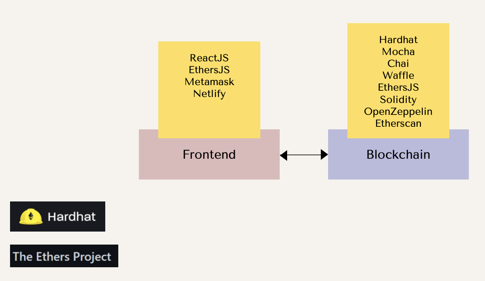
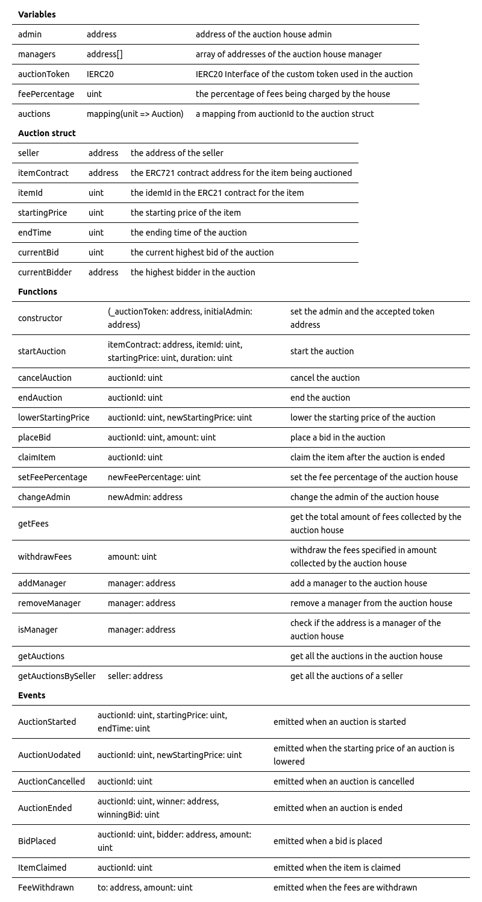

# Auction Hosue

[demo](https://auction-house-zion.netlify.app/)


## About The Project

This dApp allows users to participate in [English Auctions](https://en.wikipedia.org/wiki/English_auction).

A seller can:

- **auction digital item (ERC721)**: sends item to auction house with starting price in Auction House Coin (ERC20) with symbol AUC, and auction end time. Users can create a new digital item or send an existing one. To keep it simple, AUC can be minted by anyone.
- **cancel auction**: bids no longer allowed, item returns to seller. Cannot cancel after auction end time.
- **end auction**: item sent to highest bidder, AUC sent to seller. Auctions can be ended before time runs out.
- **lower starting price**: starting price is lowered.

A buyer can:

- **place bid**: sends AUC to auction house for an auction. If the auction is not new, and is higher bid than the previous, send the AUC of the old bid back to the old bidder. Cannot place bid after auction has ended.
- **claim item**: item sent to highest bidder, AUC sent to seller. Claim can occur only after auction ends.

An admin can:

- **set fee**: set a fee (default 2.5%) for all successful auctions. Fees are sent to the auction contract
- **change admin**: change the admin address
- **withdraw fees**: withdraw fees collected to admin address
- **add/remove managers**: add/remove managers, who can set fess and withdraw fees to admin address


### Built With

#### Frontend:

- [ReactJS](https://reactjs.org/docs/getting-started.html): Frontend library to building Single Page Applications 
- [EtherJS](https://docs.ethers.io/): JS library used for integrating with EVM
- [Metamask](https://docs.metamask.io/guide/): A decentralized wallet used for interacting with ETH dApps. It also injects a free Infura Web3 Provider to interact with the blockchain
- [Netlify](https://docs.netlify.com/get-started/): Platform to host website

#### Blockchain: 

- [Hardhat](https://hardhat.org/hardhat-runner/docs/getting-started#overview): Framework for developing, testing and deploying Smart Contracts. Uses Mocha, Chai and Waffle
- [Mocha](https://mochajs.org/): helps document and organize tests with "describe", "it", etc
- [Chai](https://www.chaijs.com/): assertion library for testing with "expect", "assert", etc 
- [Waffle](https://getwaffle.io/): tools for compiling, deploying and testing smart contracts. It also provides extra Chai methods and can be added as an extension of Mocha
- [EthersJS](https://docs.ethers.io/): JS library used for integrating with EVM
- [Solidity](https://docs.soliditylang.org/): Language used to build smart contracts
- [OpenZeppelin Contracts](https://docs.openzeppelin.com/contracts): a library of well tested smart contracts, including ERC721
- [Etherscan](https://etherscan.io/): Block explorer
- [NFT Storage](https://nft.storage/) Decentralized file storage




<!-- GETTING STARTED -->
## Getting Started

To get a local copy up and running follow these steps.

### Prerequisites

* npm
  ```sh
  npm install npm@latest -g
  ```

### Installation

1. Clone the repo
   ```sh
   git clone https://github.com/your_username_/Project-Name.git
   ```
2. Install NPM packages
   ```sh
   npm install
   ```
3. Create an .env file 
4. Get a free INFURA API Key at [https://infura.io/](https://infura.io/)
5. Get a free Etherscan API Key at [https://etherscan.io/](https://etherscan.io/)
6. Get the private key of your wallet from Metamask
7. Enter your API in `.env`
   ```js
    INFURA_API_KEY='ENTER YOUR API';
    ETHERSCAN_API_KEY='ENTER YOUR API';
    WALLET_PRIVATE_KEY='ENTER YOUR API';

   ```


<!-- USAGE EXAMPLES -->
## Usage

### Blockchain
1. Go into the contracts folder
   ```sh
   cd contracts
   ```

2. To test the smart contracts, run:
   ```sh
   npx hardhat test
   ```

3. To deploy the smart contracts locally, run:
   ```sh
   npx hardhat run scripts/deploy.js
   ```

4. To deploy the smart contracts to a sepolia testnet, run:
   ```sh
    npx hardhat run scripts/deploy.js --network sepolia
    ```

### Frontend
1. Go into the frontend folder
   ```sh
   cd frontend
   ```

2. To run the frontend, run:
   ```sh
    npm run dev
   ```

## Etherscan Links
- [AuctionToken](https://sepolia.etherscan.io/address/0xC300eF49E8047E76F2a1095A3201896735Ce6c52#code)
- [AuctionHouse](https://sepolia.etherscan.io/address/0xf20e9ed7b439FA97FC6313D3A86c95AebDC4D6Fd#code)

## tech plan


## milestones
~~MVP~~
~~100% function coverage~~
100% statement coverage
smoothen UI
add more tests
add more features


